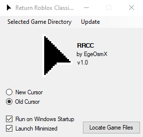

# Return Roblox Classic Cursor

- [What is RRCC?](#what-is-rrcc)
- [How does this tool work?](#how-does-this-tool-work)
- [Supported Systems](#supported-systems)
- [Installation](#installation)

  

## What is RRCC?

RRCC (Return Roblox Classic Cursor) restores the classic Roblox cursor and automatically reapplies it after Roblox updates.

The tool can automatically detect your Roblox installation, replace the current cursor files with the selected classic cursor, and monitor Roblox updates to keep the classic cursor active.

 

## How does this tool work?

<ol>
  <li>Launch the application.</li>

  <li>
    Click <strong>Locate Game Files</strong> and select your preferred mode:
    <ul>
      <li><strong>Auto</strong> - Automatically finds the latest Roblox installation (recommended).</li>
      <li><strong>Manual</strong> - Lets you select <code>RobloxPlayerBeta.exe</code> manually.</li>
    </ul>
  </li>

  <li>
    Choose your preferred cursor style:
    <ul>
      <li>New Cursor</li>
      <li>Classic Cursor</li>
    </ul>
  </li>

  <li>
    Optionally enable <strong>Background Monitoring</strong> to automatically reapply the selected cursor after Roblox updates.
  </li>
</ol>

That's it! RRCC will replace the Roblox cursor files and keep your selected cursor active whenever possible.

 

## Supported Systems

- Windows 10 (32-bit and 64-bit)
- Windows 11 (64-bit)

Other systems are not supported and may not work correctly.

 

## Installation

1. Download the latest release from the [Releases](https://github.com/EgeOsmX/ReturnRobloxClassicCursor/releases) page.  
2. Open `RRCC.exe` (no admin rights required).

 
Return Roblox Classic Cursor (RRCC) is an independent project and is not affiliated with, endorsed by, or sponsored by Roblox Corporation in any way. 
This project is <strong>MIT Licensed</strong>; attribution is required if modified. 
This is an <strong>open-source project</strong>.

